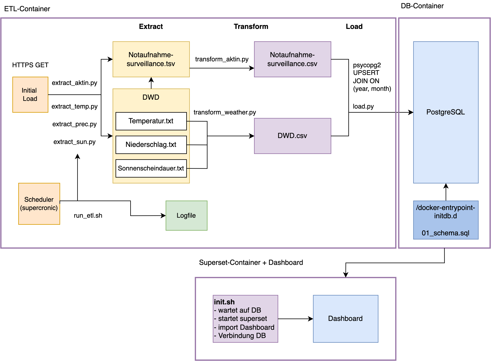
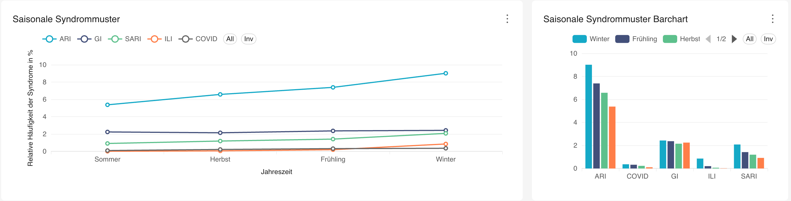
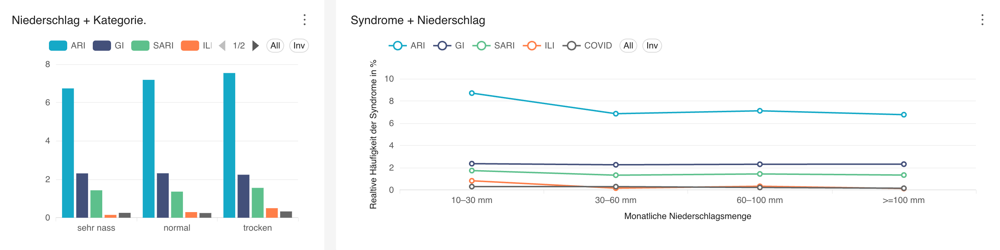
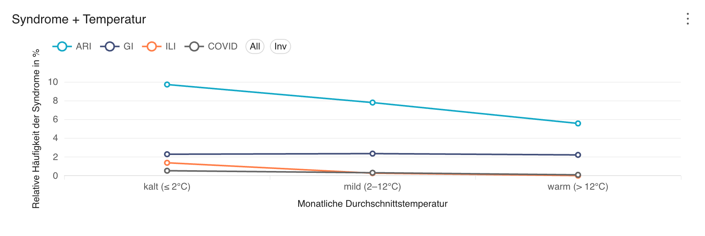
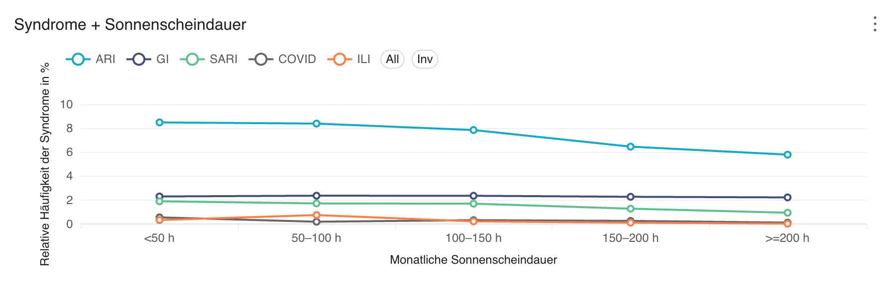
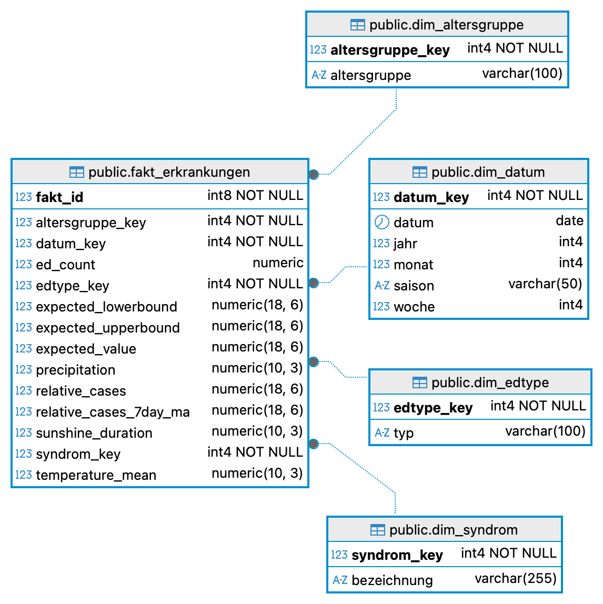

# DWH – Containerisierte ETL-Strecke (AKTIN + DWD) & Visualisierung

Dieses Projekt baut ein kleines Data Warehouse (PostgreSQL) und lädt periodisch Daten aus zwei Open-Data-Quellen:
- **AKTIN / RKI Notaufnahmesurveillance** (.tsv)
- **DWD Wetterdaten** (.txt, monatlich: Temperatur / Niederschlag / Sonnenscheindauer)

Quellen:
- AKTIN (RKI): `https://github.com/robert-koch-institut/Daten_der_Notaufnahmesurveillance`
- DWD (Beispielpfad Temperatur): `https://opendata.dwd.de/climate_environment/CDC/regional_averages_DE/monthly/air_temperature_mean/`

---

## Voraussetzungen
- Docker + Docker Compose (Plugin) installiert

---

## Konfiguration
Die Konfiguration erfolgt über `.env` im Projektroot (Ports, DB-Credentials, Superset-Login).

Beispielwerte sind bereits enthalten:
- Postgres: `POSTGRES_USER`, `POSTGRES_PASSWORD`, `POSTGRES_DB`, `POSTGRES_PORT`
- Adminer: `ADMINER_PORT`
- Superset: `SUPERSET_PORT`, `SUPERSET_SECRET_KEY`, `SUPERSET_ADMIN_*`

falls die .env geändert wird, dann auch /superset/assets/database.yaml anpassen

```bash
databases:
  - database_name: DWH
    sqlalchemy_uri: postgresql+psycopg2://admin:passwort@db:5432/mydb #anpassen
    expose_in_sqllab: true
    allow_run_async: false
```

beachte: wenn die .env geändert wird, dann scheitert der Import des Dashboards auf Superset

---

## Installation / Start

Zu beachten ist, dass Superset mindestens 60 Sekunden braucht, um zu starten, da Healthchecks durchgeführt werden.
Superset ist erreichbar unter:
http://localhost:8088/superset/welcome/

Superset: username: admin; passwort: admin

Adminer und Postgres: server: db ; Datenbank: mydb ; username: admin ; passwort: passwort

Im Projektroot ausführen:

```bash
docker compose up --build
docker compose down     
```
---

## Architekturdiagramm



---

## Visualisierung & Datenauswertung
Saisonalität:
Darstellung der relativen Syndromhäufigkeiten nach Jahreszeiten, um saisonale Muster und wiederkehrende Trends zu identifizieren.


Niederschlag:
Analyse der durchschnittlichen relativen Syndromhäufigkeit in Abhängigkeit von der monatlichen Niederschlagsmenge, gruppiert nach Niederschlagsklassen.


Temperatur:
Vergleich der relativen Syndromhäufigkeiten in Abhängigkeit von der durchschnittlichen Monatstemperatur, eingeteilt in Temperaturklassen.


Sonnenscheindauer:
Untersuchung der relativen Syndromhäufigkeit in Abhängigkeit von der monatlichen Sonnenscheindauer, dargestellt über Klassen geringer bis hoher Sonnenscheindauer.


---

## ERM

Im Folgenden ist das ER-Diagramm dargestellt. Es zeigt ein Sternschema des Data Warehouses, bestehend aus einer zentralen Faktentabelle und vier Dimensionstabellen. Die AKTIN-Notaufnahmedaten und die Wetterdaten wurden über die gemeinsamen Zeitattribute Jahr und Monat verknüpft und zusammengeführt.
<p align="center">
  
</p>
Die enthaltenen Attribute in der Faktentabelle haben folgende Bedeutung:

- **relative_cases:** relativer Anteil der beobachteten Fälle eines Syndroms im Verhältnis zur Gesamtzahl der gemeldeten Notaufnahmefälle.

- **relative_cases_7day_ma:** geglätteter Wert der relativen Fallzahlen auf Basis eines gleitenden 7-Tage-Mittels.

- **expected_value:** erwarteter Referenzwert der relativen Fallzahlen basierend auf historischen Vergleichsdaten.

- **expected_lowerbound / expected_upperbound:** untere und obere Grenze des erwarteten Wertebereichs zur Einordnung von Abweichungen.
  
- **ed_count:** durchschnittliche Anzahl der in die Surveillance einbezogenen Notaufnahmen im betrachteten Monat.
  
- **temperature_mean:** durchschnittliche monatliche Lufttemperatur in Deutschland.
  
- **precipitation:** durchschnittliche monatliche Niederschlagsmenge.

- **sunshine_duration:** durchschnittliche monatliche Sonnenscheindauer.
